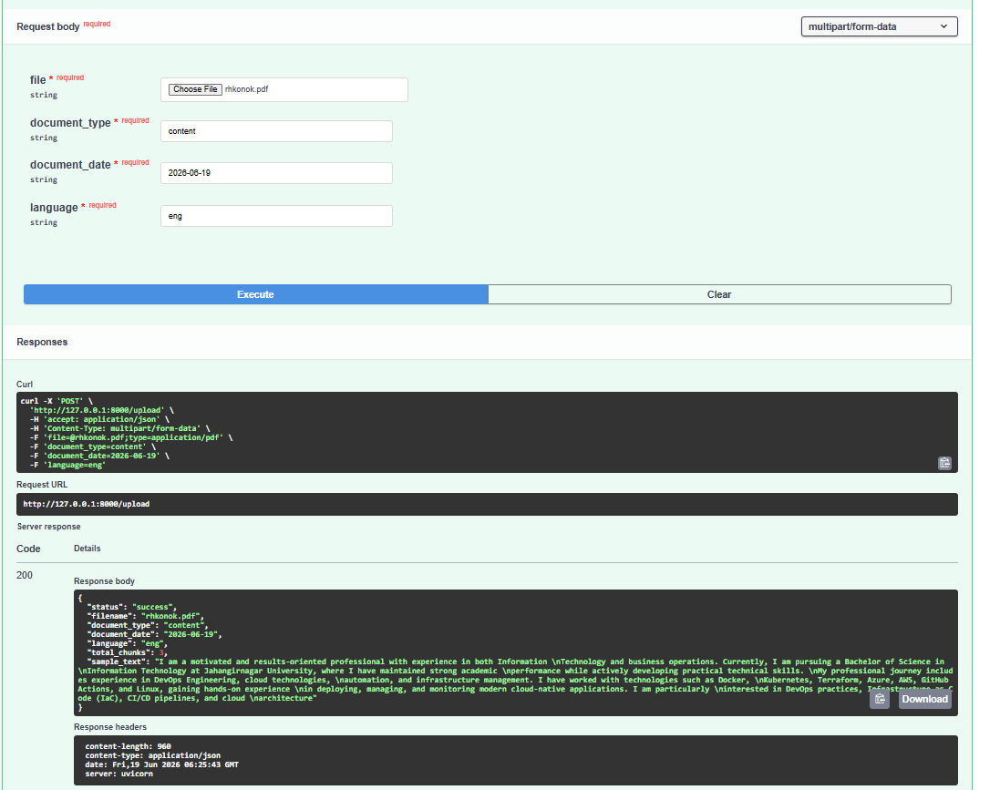
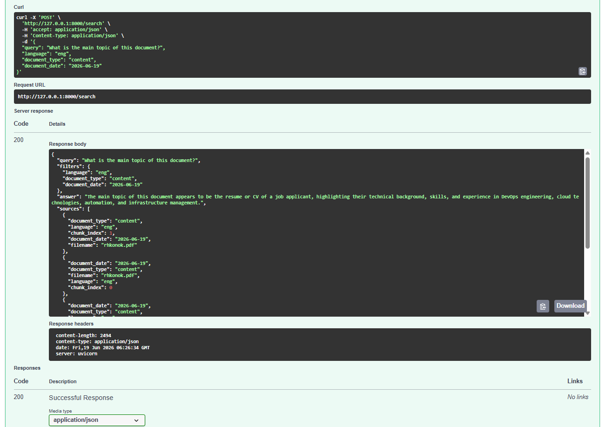

# Local OCR & Dynamic RAG System

## Overview

This project was developed for **Assessment 3: Local OCR & Dynamic RAG System**.

The system provides a fully localized document processing pipeline capable of handling Bangla, English, and mixed-language documents without relying on external commercial OCR APIs.

Uploaded PDF or image documents are processed locally using Tesseract OCR, chunked, embedded using a multilingual embedding model, stored in ChromaDB, and queried through a Retrieval-Augmented Generation (RAG) pipeline powered by a local Ollama LLM.

---

# Features

✅ Upload scanned PDFs and images

✅ Local OCR using Tesseract OCR (`ben+eng`)

✅ Support for Bangla, English, and mixed-language documents

✅ Automatic text extraction from normal PDFs

✅ OCR fallback for scanned PDFs

✅ Text chunking with overlap

✅ Multilingual embeddings

✅ ChromaDB vector database

✅ Dynamic metadata filtering

✅ Semantic vector search

✅ Local RAG using Ollama (`llama3.2`)

✅ No external commercial OCR APIs

---

# Technology Stack

| Component | Technology |
|------------|------------|
| Backend | FastAPI |
| OCR Engine | Tesseract OCR |
| Vector Database | ChromaDB |
| Embedding Model | paraphrase-multilingual-MiniLM-L12-v2 |
| Local LLM | Ollama (llama3.2) |
| Language Support | Bangla + English |
| PDF Processing | pypdf, pdf2image |
| Image Processing | Pillow |

---

# Project Structure

```text
local-ocr-rag/
│
├── app/
│   ├── __init__.py
│   ├── main.py
│   ├── ocr.py
│   ├── chunker.py
│   ├── vector_store.py
│   └── rag.py
│
├── uploads/
│
├── chroma_db/
│
├── input.png
├── result.png
│
├── requirements.txt
├── README.md
├── Dockerfile
└── docker-compose.yml
```

---

# System Architecture

```text
User Upload
     │
     ▼
FastAPI Backend
     │
     ▼
PDF/Image Processing
     │
     ▼
Local OCR (Tesseract OCR)
     │
     ▼
Text Extraction
     │
     ▼
Chunking (700 chars + 120 overlap)
     │
     ▼
Multilingual Embedding
(paraphrase-multilingual-MiniLM-L12-v2)
     │
     ▼
ChromaDB Vector Store
     │
     ├── Metadata Filtering
     │     ├── Language
     │     ├── Document Type
     │     └── Document Date
     │
     ▼
Vector Similarity Search
     │
     ▼
Ollama (llama3.2)
     │
     ▼
Final RAG Answer
```

---

# Installation Guide

## Step 1: Create Virtual Environment

```powershell
python -m venv venv
```

Activate:

```powershell
.\venv\Scripts\Activate.ps1
```

If PowerShell blocks activation:

```powershell
Set-ExecutionPolicy -ExecutionPolicy RemoteSigned -Scope CurrentUser

.\venv\Scripts\Activate.ps1
```

---

## Step 2: Install Dependencies

```powershell
pip install -r requirements.txt
```

---

## Step 3: Install Tesseract OCR

```powershell
winget install UB-Mannheim.TesseractOCR
```

Verify installation:

```powershell
& "C:\Program Files\Tesseract-OCR\tesseract.exe" --version
```

Verify language packs:

```powershell
& "C:\Program Files\Tesseract-OCR\tesseract.exe" --list-langs
```

Expected output:

```text
ben
eng
```

---

## Step 4: Install Poppler

Download Poppler and add:

```text
C:\poppler\Library\bin
```

to Windows Environment Variables.

Verify:

```powershell
pdftoppm -v
```

---

## Step 5: Install Ollama

```powershell
winget install Ollama.Ollama
```

Download model:

```powershell
ollama pull llama3.2
```

Verify:

```powershell
ollama list
```

Expected:

```text
llama3.2
```

---

# Running the Application

Start the server:

```powershell
uvicorn app.main:app --reload
```

Open Swagger UI:

```text
http://127.0.0.1:8000/docs
```

---

# Upload API

Endpoint:

```text
POST /upload
```

Parameters:

| Field | Example |
|---------|---------|
| file | sample.pdf |
| document_type | contract |
| document_date | 2026-06-19 |
| language | bn / eng / mixed |

Example:

```text
document_type = content
document_date = 2026-06-19
language = eng
```

---

# Search API

Endpoint:

```text
POST /search
```

Example Request:

```json
{
  "query": "What is the main topic of this document?",
  "language": "eng",
  "document_type": "content",
  "document_date": "2026-06-19"
}
```

---

# Demo Screenshots

## Document Upload

The document is uploaded through the FastAPI Swagger interface along with metadata fields.



---

## Dynamic RAG Search Result

The system applies metadata filtering and semantic vector search before generating an answer using the local Ollama model.



---

# Example Test Case

## Uploaded Document

| Field | Value |
|---------|---------|
| File Name | rhkonok.pdf |
| Document Type | content |
| Document Date | 2026-06-19 |
| Language | eng |

---

## Query

```json
{
  "query": "What is the main topic of this document?",
  "language": "eng",
  "document_type": "content",
  "document_date": "2026-06-19"
}
```

---

## Result

The system correctly identified that the document is a resume/CV and summarized the candidate’s experience in:

- DevOps Engineering
- Cloud Technologies
- Infrastructure Management
- Automation
- Kubernetes
- Terraform
- Azure
- AWS

---

# OCR Model Choice

## Selected OCR Engine

### Tesseract OCR

Tesseract OCR was selected because:

- Fully local execution
- Open-source
- Supports Bangla and English
- No commercial API dependency
- Easy integration with Python

### Trade-offs

Advantages:

- Fast
- Lightweight
- Free
- Good printed text recognition

Limitations:

- Lower accuracy for handwriting
- Sensitive to low-resolution scans
- Struggles with complex Bangla conjunct characters
- Performance decreases on skewed documents

### Baseline Accuracy

| Document Type | Accuracy |
|--------------|----------|
| Clean English PDF | High |
| Clean Bangla PDF | Moderate to High |
| Mixed Bangla-English | Moderate |
| Noisy Scanned Bangla | Lower |

---

# Chunking Strategy

The system uses:

```text
Chunk Size = 700 characters
Overlap = 120 characters
```

Reason:

- Preserves context
- Reduces information loss
- Maintains semantic continuity
- Improves retrieval quality

---

# Embedding Model Selection

Model:

```text
paraphrase-multilingual-MiniLM-L12-v2
```

Why this model?

- Supports Bangla and English
- Multilingual semantic search
- Lightweight
- Runs locally
- Suitable for OCR-generated content

---

# Dynamic Metadata Filtering

The system supports:

- Language Filter
- Document Type Filter
- Document Date Filter

Example:

```json
{
  "language": "eng",
  "document_type": "content",
  "document_date": "2026-06-19"
}
```

Process:

```text
User Query
      │
      ▼
Metadata Filter
      │
      ▼
Filtered ChromaDB Documents
      │
      ▼
Vector Similarity Search
      │
      ▼
Top Matching Chunks
      │
      ▼
Ollama
      │
      ▼
Final Answer
```

This hybrid architecture ensures that semantic search is performed only on documents matching the selected metadata constraints.

---

# Assessment Requirement Mapping

| Requirement | Implementation |
|------------|---------------|
| Document Upload | FastAPI Upload Endpoint |
| Local OCR | Tesseract OCR |
| Bangla Support | ben Language Pack |
| English Support | eng Language Pack |
| Multilingual Processing | Supported |
| Text Chunking | Custom Chunker |
| Embeddings | MiniLM Multilingual |
| Vector Store | ChromaDB |
| Metadata Filtering | Language, Type, Date |
| Semantic Search | Vector Similarity |
| Dynamic RAG | Ollama + ChromaDB |
| Local Processing | Fully Local |
| No External OCR APIs | Yes |

---

# Future Improvements

- Surya OCR integration
- Hybrid BM25 + Vector Search
- OCR confidence scoring
- Automatic language detection
- Page-level filtering
- Authentication system
- User dashboard
- Dockerized deployment

---

# Author

Developed as part of the AI Engineer Technical Assessment.

Local OCR + Dynamic RAG System using FastAPI, Tesseract OCR, ChromaDB, and Ollama.